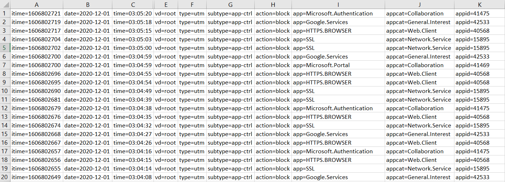
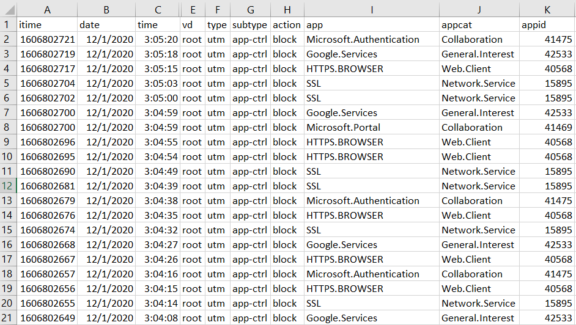
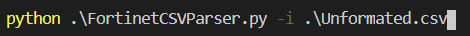
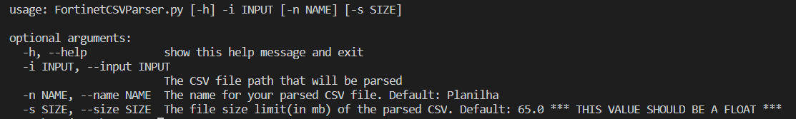

# Fortinet CSV Parser

This is a little script made by me to help my team automate their operations.


### Requirements

You must have python 3.x installed in your machine. Please visit https://www.python.org/ and install the latest 3.x version.

Also, when installing, select the box to **add Python to the PATH variable** (if you are installing it in **Windows**).


### What does it do?

This script ingests a .csv generated by the Fortinet solution, which is not parsed, parse it and write the information in a new ".csv" file. 

##### Input




##### Output




### Basic usage

```
python PATH_TO_SCRIPT -i PATH_TO_CSV
```

##### Example:




### Understanding the Parameters

This script has 3 parameters and 1 help flag:

- **-i** (or **--input**) = This one is mandatory. Use it to set the input ".csv" file path. 

- **-n** (or **--name**) = This one is an optional parameter. You can use this one to give the output ".csv" file a custom name. **The default name used is "Planilha1"**.

- **-s** (or **--size**) = This one is also an optional parameter. You can set the output file size with it. Once the output file reaches the size limit, the script creates a new CSV file and continue the process (Go to **Important Notes** for more information). **The default value is 65.0** (65mb)

- **-h** (or **--help**) = This flag shows the help message

  


### Important Notes

- When the output file reaches the size limit (given by the user or not), the script creates a new CSV file and continue populating it from where it stopped. The process repeats until all data from the input CSV is processed, parsed and written to the new CSVs. Therefore, if you have an input CSV with 25mb and choose the output file size to be 10mb, the script will create 2 output CSV files containing 10mb of data, and one containing 5mb, all of them following the sequence.

